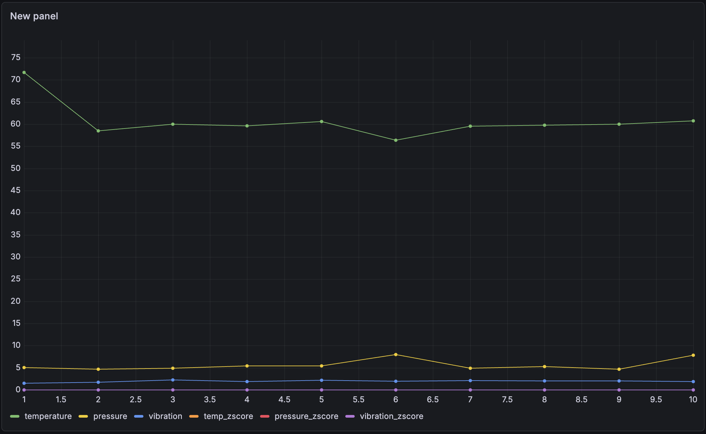

# Industrial Cloud Monitoring System


Real-time industrial monitoring platform built using **FastAPI**, **PostgreSQL**, **Docker**, **Grafana**, and **GitHub Actions**.

The project simulates industrial IoT sensors, stores telemetry data, performs rolling statistical anomaly detection, and visualizes results through automatically provisioned Grafana dashboards.

---

# Dashboard Preview



---

# Overview

This project demonstrates how a production-style industrial monitoring platform can be built using modern backend and DevOps technologies.

It combines:

- Real-time sensor simulation
- REST API development
- Statistical anomaly detection
- Containerized services
- Database persistence
- Monitoring dashboards
- Automated Grafana provisioning
- CI automation

The project follows production-oriented software engineering practices including containerization, health monitoring, automated CI validation, persistent storage, automated dashboard provisioning, and modular backend design.

---

# Architecture

```text
Sensor Simulator
        │
        ▼
FastAPI REST API
        │
        ▼
Rolling Z-Score Detector
        │
        ▼
PostgreSQL Database
        │
        ▼
Grafana Dashboard
```

---

# Container Architecture

```text
Docker Compose
│
├── PostgreSQL
│
├── FastAPI Backend
│
└── Grafana
    │
    ├── PostgreSQL Datasource Provisioning
    └── Dashboard Provisioning
```

The containers communicate through the Docker Compose network. PostgreSQL stores sensor readings, the FastAPI backend processes incoming telemetry, and Grafana visualizes the collected metrics.

Grafana datasource and dashboard configuration are automatically provisioned when the container starts.

---

# Features

- Real-time industrial sensor simulator
- Rolling Z-Score anomaly detection
- FastAPI REST API
- PostgreSQL persistence
- Grafana dashboards
- Automatic Grafana datasource provisioning
- Automatic Grafana dashboard provisioning
- Persistent Grafana storage
- Dockerized deployment
- Docker health checks
- Health endpoint (`/health`)
- GitHub Actions CI pipeline
- Docker image validation
- Docker Compose validation
- Severity classification (OK / WARN / ALERT)
- Production-style container orchestration

---

# Technology Stack

## Backend

- Python
- FastAPI
- SQLAlchemy
- Pydantic

---

## Database

- PostgreSQL

---

## Monitoring

- Grafana
- Grafana Provisioning

---

## DevOps

- Docker
- Docker Compose
- GitHub Actions

---

# Project Structure

```text
industrial-cloud-monitoring/
│
├── backend/
│   ├── Dockerfile
│   ├── main.py
│   ├── database.py
│   ├── detector.py
│   ├── models.py
│   └── simulator.py
│
├── infra/
│   ├── docker-compose.yml
│   │
│   └── grafana/
│       ├── dashboards/
│       │   └── industrial-monitoring.json
│       │
│       └── provisioning/
│           ├── dashboards/
│           │   └── dashboards.yml
│           │
│           └── datasources/
│               └── postgres.yml
│
├── assets/
│   └── dashboard.png
│
├── .github/
│   └── workflows/
│       └── ci.yml
│
├── requirements.txt
├── README.md
└── .gitignore
```

---

# Quick Start

## Clone Repository

```bash
git clone https://github.com/h2-erdogan/industrial-cloud-monitoring.git

cd industrial-cloud-monitoring
```

---

## Start the Infrastructure

```bash
docker compose -f infra/docker-compose.yml up --build
```

The Docker Compose stack launches:

- PostgreSQL
- FastAPI Backend
- Grafana

Grafana is automatically provisioned at startup with:

- PostgreSQL datasource configuration
- Industrial monitoring dashboard

No manual Grafana datasource or dashboard setup is required.

---

## Run the Sensor Simulator

Open a second terminal.

```bash
python3 backend/simulator.py
```

The simulator continuously sends industrial sensor readings to the FastAPI backend.

---

# Available Services

| Service | URL |
|----------|-----|
| FastAPI | http://localhost:8001 |
| Swagger UI | http://localhost:8001/docs |
| Grafana | http://localhost:3000 |

---

Default Grafana credentials:

```text
Username: admin
Password: admin123
```

---

# API Endpoints

| Method | Endpoint | Description |
|---------|----------|-------------|
| GET | `/` | API status |
| GET | `/health` | Health check |
| GET | `/sensor-data` | Retrieve all sensor readings |
| POST | `/sensor-data` | Store new sensor reading |

---

## Example Sensor Payload

```json
{
  "temperature": 61.2,
  "pressure": 5.4,
  "vibration": 1.8
}
```

---

## Example Response

```json
{
  "message": "Sensor data stored successfully",
  "severity": "WARN",
  "z_scores": {
    "temperature": 2.31,
    "pressure": 0.74,
    "vibration": 1.12
  }
}
```

---

# Health Endpoint

The application exposes a lightweight health endpoint.

```http
GET /health
```

Response:

```json
{
  "status": "healthy",
  "service": "industrial-monitoring-api"
}
```

This endpoint can be used by:

- Docker health checks
- Kubernetes readiness probes
- External monitoring tools

---

# Docker Services

| Service | Purpose |
|----------|---------|
| PostgreSQL | Stores sensor data |
| FastAPI | REST API backend |
| Grafana | Dashboard visualization |

The Docker Compose configuration includes:

- Automatic restart policies
- PostgreSQL health checks
- Service dependency validation
- Persistent PostgreSQL storage
- Persistent Grafana storage
- Grafana datasource provisioning
- Grafana dashboard provisioning
- Production-oriented container startup

---

# Grafana Provisioning

Grafana configuration is stored in the repository and automatically loaded when the Grafana container starts.

```text
infra/grafana/
│
├── dashboards/
│   └── industrial-monitoring.json
│
└── provisioning/
    ├── dashboards/
    │   └── dashboards.yml
    │
    └── datasources/
        └── postgres.yml
```

The PostgreSQL datasource is automatically configured to communicate with the PostgreSQL container through the Docker Compose network.

The dashboard provider automatically loads the industrial monitoring dashboard from:

```text
/var/lib/grafana/dashboards
```

This allows the monitoring environment to be reproduced without manually creating the datasource or importing the dashboard through the Grafana UI.

---

# CI/CD Pipeline

GitHub Actions automatically performs:

- Repository checkout
- Python setup
- Dependency installation
- Python syntax validation
- Docker image build
- Docker Compose configuration validation

The pipeline runs automatically on every push and pull request.

Workflow location:

```text
.github/workflows/ci.yml
```

---

# Design Decisions

This project follows several production-oriented software engineering practices.

### Containerization

- Dockerized backend
- Docker Compose orchestration
- Service isolation

### Reliability

- Health endpoint
- PostgreSQL health checks
- Restart policies
- Persistent Docker volumes

### Backend

- RESTful API
- SQLAlchemy ORM
- Pydantic request validation
- Modular application structure

### Monitoring

- Grafana dashboard visualization
- Grafana dashboard provisioning
- PostgreSQL datasource provisioning
- Statistical anomaly detection
- Severity classification

### DevOps

- Continuous Integration
- Docker image validation
- Docker Compose configuration validation
- Infrastructure configuration stored in version control

---

# Key Highlights

- Industrial IoT monitoring simulation
- Statistical anomaly detection using Rolling Z-Score
- FastAPI REST API
- PostgreSQL persistence
- Grafana dashboard visualization
- Automated Grafana datasource and dashboard provisioning
- Persistent Docker volumes
- Containerized deployment
- Health monitoring endpoint
- Production-style Docker Compose
- Automated CI pipeline using GitHub Actions
- Reproducible monitoring configuration

---

# Future Improvements

## Cloud

- Azure deployment
- Azure Container Apps
- Azure Database for PostgreSQL

## Orchestration

- Kubernetes
- Helm Charts

## Monitoring

- Prometheus
- Loki
- Alertmanager

## Streaming

- MQTT
- Apache Kafka

## AI & Analytics

- Machine Learning anomaly detection
- Predictive maintenance
- Time-series forecasting

---

# Author

**Hasibe Erdogan**

GitHub:

https://github.com/h2-erdogan
